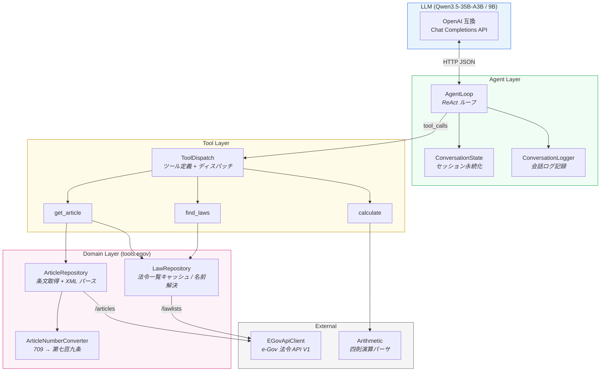

# agentic-system-poc — コードドキュメント

ローカル LLM 推論による Agentic System の段階的構築 PoC — Scala 実装ガイド

> HTML 版: [index.html](index.html)（インライン SVG 付き、ブラウザで直接開けます）

---

## 1. Overview

本プロジェクトは、LLM エージェントアーキテクチャの各概念をフレームワーク（LangChain 等）に頼らず段階的に構築する学習・PoC リポジトリです。OpenAI 互換 API を共通インターフェースとして、GPU WS 上の llama-server と Mac ローカルの mlx-lm をバックエンドに使用します。

Scala 実装は3層のレイヤーで構成されています:



パッケージ構成:

```
src/main/scala/
├── messages/     ChatMessage ADT + JSON codecs
├── agent/        AgentLoop, ConversationState, ConversationLogger
├── tools/        ToolDispatch, Arithmetic
│   └── egov/     e-Gov API クライアント (5ファイル)
└── stages/       Stage ごとのエントリポイント
```

---

## 2. 共通機能

### 2.1 messages — ChatMessage ADT

OpenAI Chat Completions API のメッセージを Scala 3 の `enum` ADT として型安全に表現します。

```scala
enum ChatMessage {
  case System(content: String)
  case User(content: String)
  case Assistant(content: Option[String], toolCalls: List[ToolCallInfo])
  case ToolResult(toolCallId: String, content: String)
}
```

**なぜ ADT か:** LLM API のメッセージは role によって構造が異なります（`assistant` は `tool_calls` を持ちうるが `user` は持たない）。JSON の `Map[String, Any]` で扱うと、これらの構造差異が実行時まで検出できません。ADT にすることで、`match` の網羅性チェックがコンパイル時に行われます。

**重要な不変条件:**
- `Assistant` の `toolCalls` が非空 → LLM がツール実行を要求している
- `Assistant` の `toolCalls` が空 → LLM の最終回答（エージェントループの終了条件）

`ChatMessage.toJson` / `fromJson` は API の JSON 形式との相互変換を行います。注意点として、`tool_calls[].function.arguments` は API では JSON **文字列**（ネストされた JSON ではない）として扱われます。

### 2.2 agent — エージェントループ

**AgentLoop** は ReAct パターンの核です:

1. メッセージ履歴 + ツール定義を LLM に送信
2. レスポンスに `tool_calls` が含まれるか判定
3. 含まれなければ → 最終回答として返す（ループ終了）
4. 含まれていれば → 各ツールを実行し、結果を `ToolResult` として履歴に追加 → 1 に戻る

`maxToolRounds`（デフォルト: 5）がガードとして機能し、LLM がツールを呼び続ける無限ループを防ぎます。

**ConversationState** は複数ターンにわたるメッセージ履歴を `sessions/{sessionId}.json` に永続化します。コンテキストウィンドウの有限性に対応するため、`truncateIfNeeded` で古いメッセージを FIFO で削除できます。

> **トークン推定:** `estimateTokens` は JSON 文字列の文字数を数えるヒューリスティックです。実際のトークン数とは 3-4 倍のずれがあります。パラメータ名 `maxTokens` は misnomer（実態は文字数）です。

**ConversationLogger** は会話ログを Markdown 形式で生成します。RESULTS.md の Discussion セクションでの定性的分析に使用されます（`stages/PROTOCOL.md` §4.1.1 参照）。

### 2.3 tools — ツールディスパッチ

`ToolDispatch` は2つの責務を持ちます:

| 責務 | メンバ | 説明 |
|------|--------|------|
| スキーマ定義 | `toolDefs` | OpenAI API の `tools` パラメータとして送信される JSON。LLM はこれを見てツールを選択する。**description は事実上プロンプトの一部** |
| ディスパッチ | `dispatch` | LLM が返した `tool_calls` を受け取り、対応する実装に振り分ける |

**ツール追加の手順:**
1. `toolDefs` の `Json.arr` にツール定義を追加
2. `dispatch` の `match` に `case` を追加
3. ツールの実装を作成（`tools/` または `tools/egov/` パッケージ）

現在のツール一覧:

| ツール名 | 機能 | 実装 |
|----------|------|------|
| `find_laws` | 法令名キーワード検索 | `egov.LawRepository.findByKeyword` |
| `get_article` | 条文取得（lawId + 条番号） | `egov.LawRepository.resolveLawId` + `egov.ArticleRepository.getArticle` |
| `calculate` | 四則演算 | `Arithmetic.calculate` |

---

## 3. e-Gov 法令 API クライアント

### 3.1 アーキテクチャ

`tools.egov` パッケージは e-Gov 法令 API V1 をラップして、LLM の Tool Calling から利用できるインターフェースを提供します。

```
ToolDispatch
  ├─ LawRepository    ← 法令一覧キャッシュ + 名前解決
  │    └─ EGovApiClient.fetchLawList()   ← /lawlists/2
  └─ ArticleRepository ← 条文取得 + XML パース
       ├─ ArticleNumberConverter  ← "709" → "第七百九条"
       └─ EGovApiClient.fetchArticle()   ← /articles;lawId=...;article=...
```

**EGovApiClient** は HTTP リクエストと XML パースのみを担当する薄いラッパーです。同期・ブロッキング設計（LLM 推論がボトルネックのため非同期化の利点が薄い）。

> **URL 形式の注意:** `/articles` エンドポイントは標準的なクエリパラメータ（`?key=value`）ではなく、**セミコロン区切りの matrix parameter** を使用します（JAX-RS 形式）。sttp の URI 補間子はこれに対応しないため、完全な URL 文字列を構築して `Uri.unsafeParse` で変換しています。

### 3.2 find_laws → get_article パイプライン

LLM が法令の条文を取得する典型的なフロー:

```
User: 「個人情報保護法の第1条を見せてください」

1. LLM → find_laws(keyword="個人情報")
   → LawRepository.findByKeyword → e-Gov /lawlists/2
   → "個人情報の保護に関する法律 [ID: 415AC0000000057]"

2. LLM → get_article(law_id_or_name="415AC0000000057", article_number="1")
   → LawRepository.resolveLawId → lawId はそのまま通過
   → ArticleNumberConverter: "1" → "第一条"
   → EGovApiClient.fetchArticle → e-Gov /articles;lawId=...;article=第一条
   → XML パース → ArticleContent → toText
```

LLM は Step 1 の結果から lawId を記憶し、Step 2 でそれを使います。`find_laws` の返却フォーマットに `[ID: ...]` を含めているのは、LLM がこの情報をピックアップしやすくするためです。

### 3.3 法令名の解決

`LawRepository.resolveLawId` は、LLM が指定する多様な形式の法令名を lawId に変換します。4段階のフォールバックチェーン:

| 段階 | 条件 | 例 |
|------|------|-----|
| 1. lawId 検出 | 半角英数のみ | `"415AC0000000057"` → そのまま |
| 2. 完全一致 | 法令一覧の lawName と一致 | `"民法"` → `"129AC0000000089"` |
| 3. 前方/部分一致 | 1件なら解決、複数なら Ambiguous | `"消費者"` → Ambiguous（2件） |
| 4. KnownLaws | ハードコード短縮名（6法） | キャッシュ未ロード時のフォールバック |

Ambiguous の場合、エラーメッセージに候補一覧と「`find_laws` で法令IDを確認してください」の誘導を含めます。これにより LLM が「まず検索してから取得」のフローを学習しやすくなります。

### 3.4 条番号の漢数字変換

e-Gov API は条番号を漢数字全角で受け付けます（`article=第七百九条`）。LLM はアラビア数字（`"709"`）で指定するため、`ArticleNumberConverter` が変換を行います。

```scala
ArticleNumberConverter.toKanjiArticle(709)   // → "第七百九条"
ArticleNumberConverter.toKanjiArticle(1)     // → "第一条"
ArticleNumberConverter.toKanjiParagraph(3)   // → "第三項"
```

対応範囲は 1〜9999。枝番号（第709条の2）は未対応。

---

## 4. ステージ別実装

### Stage 0–3: scala-cli スクリプト

sbt 移行前のスクリプト。各ステージの実験記録として `stages/stageN/` に残っています。

| Stage | スクリプト | 概要 |
|-------|----------|------|
| 0 | `stages/stage0/latency.scala` | 推論 API 疎通・レイテンシ計測 |
| 1 | `stages/stage1/structured_output.scala` | 構造化出力の3手法比較（45試行） |
| 2 | `stages/stage2/agent_path_a.scala`, `agent_path_b.scala` | tool calling のパスA/B比較 |
| 3 | `stages/stage3/routing.scala` | 3ツールルーティング精度比較 |

各ステージの実験結果は `stages/stageN/RESULTS.md`（IMRaD 形式）に記録されています。

### Stage 4: sbt プロジェクト（現在の実装）

`stages.Stage4Main` が10件のクエリを順に実行し、複数ターン対話の動作を検証します。

```bash
sbt "runMain stages.Stage4Main"
```

環境変数 `STAGE4_LOG` で会話ログの出力先を変更できます（Round 2 実験で使用）。

---

## 5. Usage

### 環境変数の設定

`.claude/settings.local.json` の `env` セクションで設定するか、`.env` ファイルを使用します:

```bash
# 大学: GPU WS
LLM_BASE_URL=http://<GPU-WS-IP>:8080/v1
LLM_API_KEY=dummy
LLM_MODEL=local

# 自宅: mlx-lm
LLM_BASE_URL=http://localhost:8000/v1
LLM_MODEL=mlx-community/Qwen3.5-9B-MLX-8bit
```

### ビルド・テスト

```bash
# コンパイル
sbt compile

# ユニットテスト（ネットワーク不要）
sbt "testOnly tools.egov.ArticleNumberConverterTest tools.egov.LawRepositoryTest"

# 全テスト（統合テストはネットワーク必要）
sbt test

# API ドキュメント生成
sbt doc
# → target/scala-3.6.4/api/index.html
```

### 実行

```bash
# Stage 4 実験（LLM サーバーが起動している必要あり）
sbt "runMain stages.Stage4Main"

# scala-cli スクリプト（Stage 0-3）
scala-cli run stages/stage0/latency.scala
```

### ツール追加の手順

1. `src/main/scala/tools/` にツール実装を作成
2. `ToolDispatch.toolDefs` にツール定義 JSON を追加（`description` は LLM のプロンプトの一部）
3. `ToolDispatch.dispatch` に `case` を追加
4. テストを追加（`src/test/scala/`）
5. `sbt test` で全テスト通過を確認
